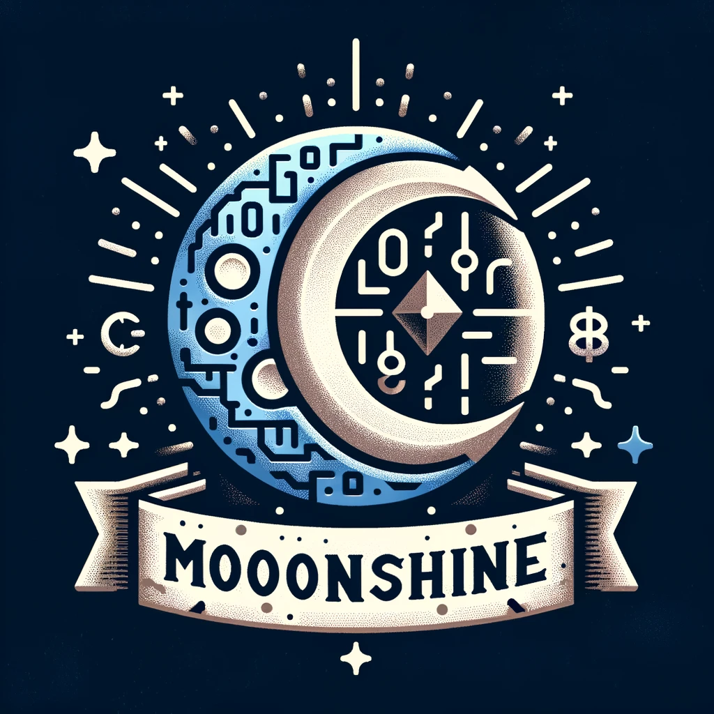
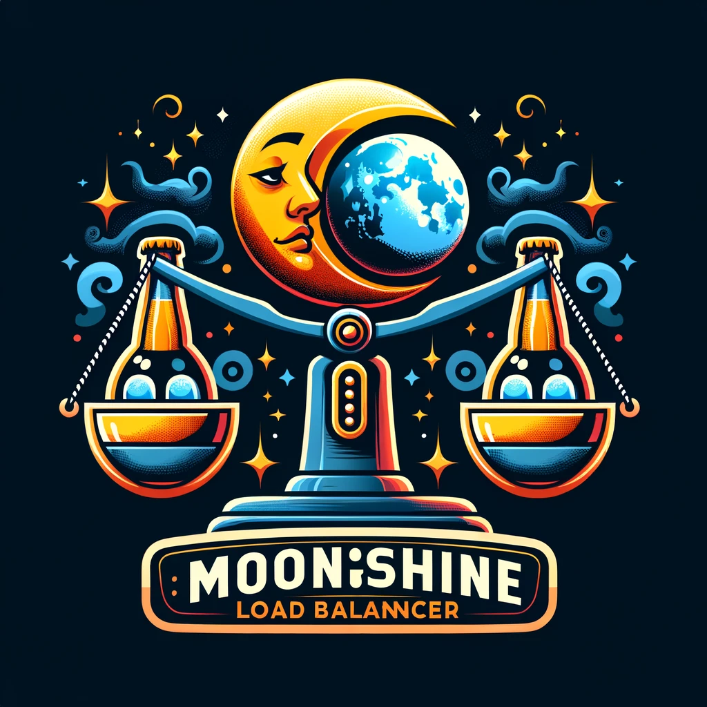

# Rinha de Backend 2024 - Q1 - Moonshine edition

## Stack

Base:
- Rust
- Tokio
- Axum

Load balancer e banco de dados próprios.

## Services

### Moonshine Database

### Moonshine Load balancer

### Moonshine API

